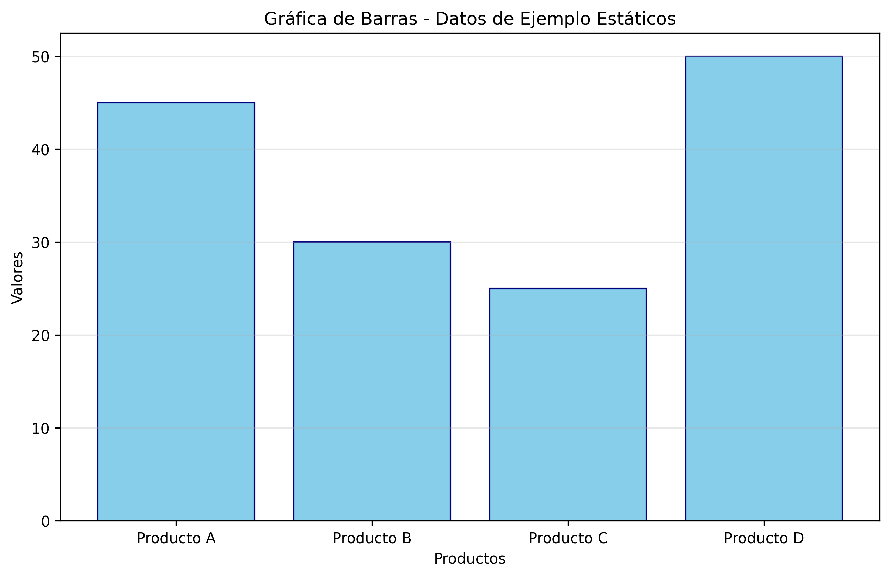
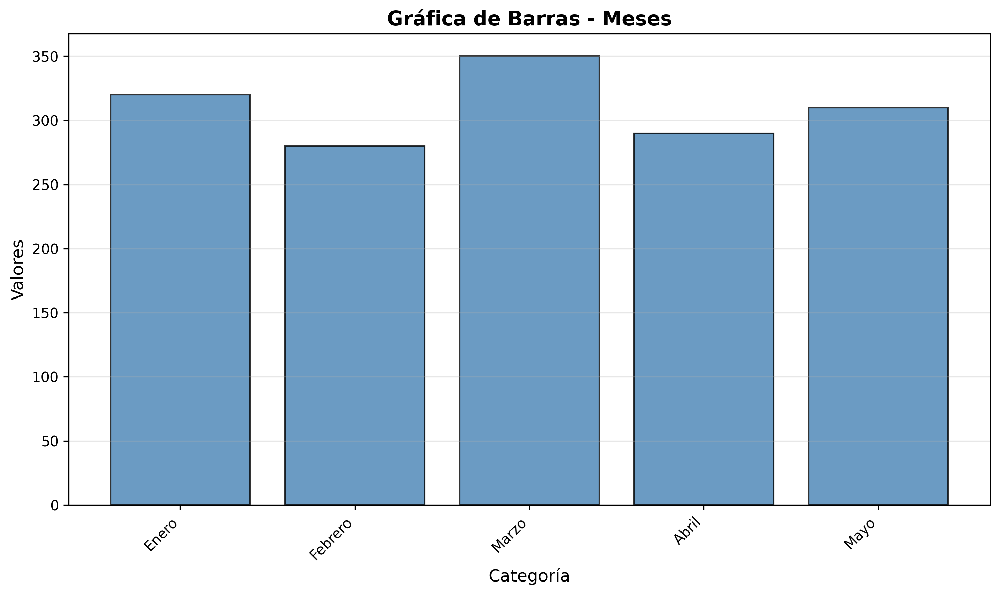
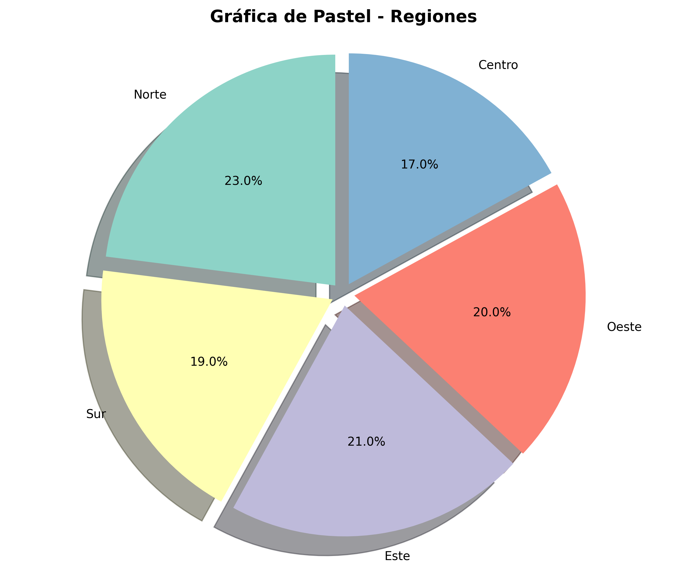
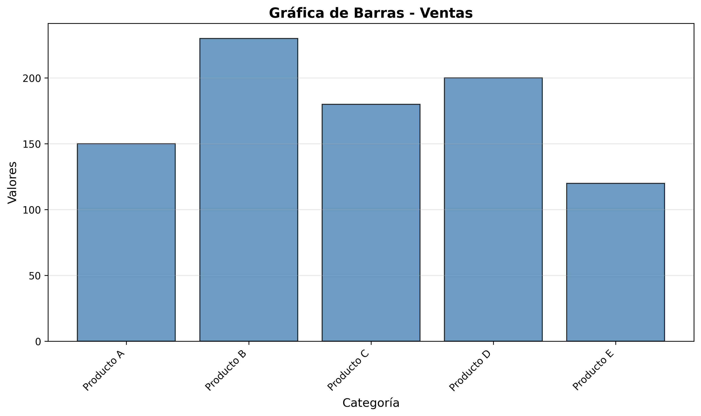
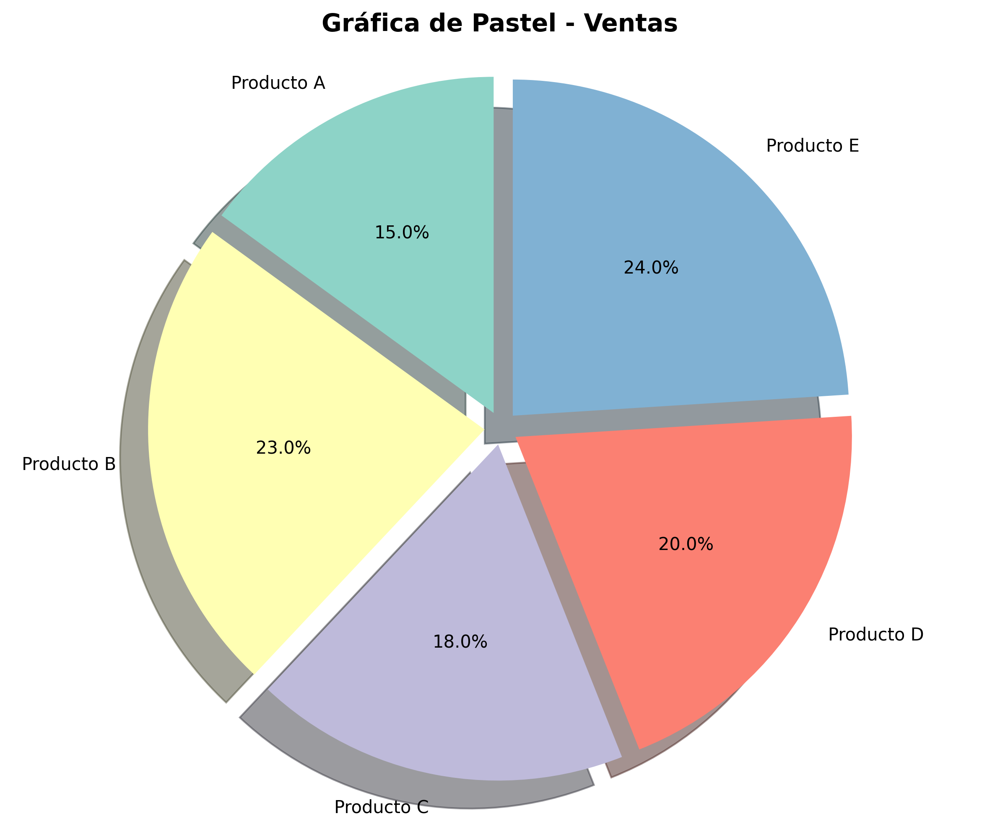
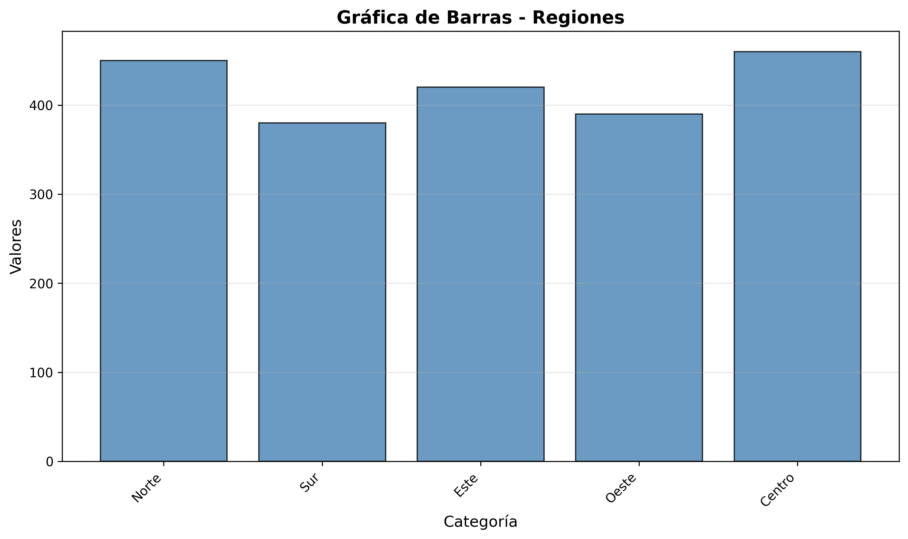

# Práctica 4 - Análisis de Datos con Pandas y Gráficas con Matplotlib

---

## Información del Proyecto

- **Asignatura:** Ofimática y Tecnología Multimedia
- **Práctica:** Práctica 4 - Manejo Avanzado de Hojas de Cálculo
- **Estudiante:** Marshel Aillón Cardozo

## Descripción

Esta práctica tiene como objetivo desarrollar habilidades avanzadas de procesamiento de datos mediante scripts automatizados en Python. Se implementa la lectura de archivos Excel con múltiples hojas, análisis de datos con Pandas y generación automática de gráficas con Matplotlib.

## Requisitos Previos

- Python 3.9 o superior
- pip (Python Package Manager)

## Instalación

### 1. Clonar el repositorio

```bash
git clone https://github.com/marshelaillon/otm_106_practica4
cd otm_106_practica4
```

### 2. Instalar dependencias

```bash
pip install -r requirements.txt
```

## Ejecución

Para ejecutar el script principal:

```bash
python main.py
```

El script realizará las siguientes acciones:
1. Creará la carpeta `output/` si no existe
2. Generará una gráfica de barras con datos estáticos de ejemplo
3. Leerá todas las hojas del archivo `datos_base.xlsx`
4. Generará gráficas de barras y pastel para cada hoja
5. Guardará todas las gráficas en formato PNG en la carpeta `output/`

## Funcionalidades Implementadas

### Parte 1: Gráfica Estática de Ejemplo
Script que genera una gráfica de barras con datos estáticos predefinidos.

### Parte 2: Lectura y Análisis de Datos
- Lectura automática de todas las hojas del archivo Excel
- Uso de Pandas para manipulación de DataFrames
- Procesamiento iterativo de múltiples hojas
- Generación de gráficas de barras
- Generación de gráficas de pastel

## Parte 3: Guardado de Gráficas
Todas las gráficas se guardan automáticamente en formato PNG (300 DPI) con nombres descriptivos que identifican la hoja de origen.

## Gráficas Generadas

### Gráfica de Ejemplo Estática



*Descripción: Gráfica de barras generada con datos estáticos de ejemplo*

---

### Hoja 1 - Análisis de Datos

#### Gráfica de Barras



*Descripción: Gráfica de barras mostrando los valores de la Hoja 1*

#### Gráfica de Pastel



*Descripción: Gráfica de pastel mostrando los porcentajes de la Hoja 1*

---

### Hoja 2 - Análisis de Datos

#### Gráfica de Barras



*Descripción: Gráfica de barras mostrando los valores de la Hoja 2*

#### Gráfica de Pastel



*Descripción: Gráfica de pastel mostrando los porcentajes de la Hoja 2*

---

### Hoja 3 - Análisis de Datos

#### Gráfica de Barras



*Descripción: Gráfica de barras mostrando los valores de la Hoja 3*

#### Gráfica de Pastel


*Descripción: Gráfica de pastel mostrando los porcentajes de la Hoja 3*

---

## Datos de Ejemplo

El archivo `datos_base.xlsx` debe contener hojas con la siguiente estructura:

| Categoría | Valores | Porcentaje |
|-----------|---------|------------|
| Item 1    | 45      | 25         |
| Item 2    | 30      | 20         |
| Item 3    | 25      | 15         |
| Item 4    | 50      | 40         |